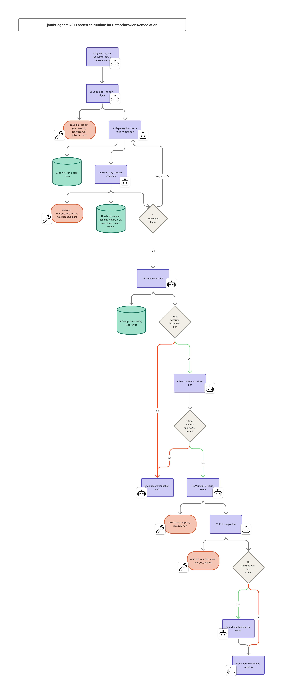

# jobfix-agent

**[→ View the Skill Hub site](docs/index.html)** — opens best in a browser (GitHub's file viewer shows source, not the rendered page); see [Skill Hub](#skill-hub-this-repos-website) below for other ways to view it, including a live-hosted preview and one-time GitHub Pages setup.

A reusable, assistant-agnostic skill for diagnosing failed or anomalous
Databricks pipelines. Handed off here so any engineer — on Claude Code,
GitHub Copilot, Genie, or an internal assistant — can point their tool at
this repo and get consistent, evidence-driven root-cause behavior.

## What's in this repo

```
skills/jobfix-agent/SKILL.md   The skill itself — read this first
PROMPTS.md                     How to invoke it for every real scenario,
                                plus tips for getting the best results
docs/index.html                Skill Hub — the full overview website
docs/architecture.jpg          Architecture diagram used in this README
                                and on the Skill Hub site
```

## What it does, in one paragraph

Given a `run_id`, a `{job_name, date}`, or a `{dataset, date, metric}`
signal, it maps the failed job's neighborhood (upstream/downstream, up to
2 hops), forms a specific falsifiable hypothesis about the root cause,
fetches only the read-only Databricks evidence needed to test it, and
returns one of five structured verdicts: `FIX_RECOMMENDED`,
`VERIFICATION_STEP_PROVIDED`, `NOT_A_CODE_ISSUE`, `OBSERVABILITY_GAP`, or
`OUT_OF_SCOPE`.

It is **diagnostic by default**. Nothing in Databricks is written to,
edited, or rerun unless a human explicitly asks — twice, at two separate
gates (implement → apply-and-rerun). See `PROMPTS.md` §5 for exactly how
to phrase both.

## Architecture



> **Note:** this diagram shows the *available* tool surface and step
> sequence, not a fixed execution trace. The actual number of tool calls,
> LLM invocations, and evidence-gathering rounds varies case to case,
> driven by the complexity of the failure pattern — a clean `run_id`
> lookup may resolve in one or two calls, while a multi-hop upstream
> hypothesis with a revised (ruled-out) round can invoke several more.
> Treat the diagram as the shape of the workflow, not a step-count
> guarantee.

## Scope

Databricks only — Jobs API, SQL warehouse, notebook source, schema
history, cluster event history. No Airflow, no Kubernetes, no cloud
object storage access. Signals from those systems get an honest
`OUT_OF_SCOPE` verdict, not a guess.

## Quickstart

1. Read `skills/jobfix-agent/SKILL.md` once, end to end — it's short and
   it's the actual contract the agent follows, not just documentation.
2. Wire it into your assistant of choice — see **Assistant setup** in
   `PROMPTS.md` §7.
3. Use the prompt patterns in `PROMPTS.md` for run_id diagnosis, task-level
   scoping, data-quality signals, quick-fix flow, and HITL review/approval.

## Skill Hub (this repo's website)

`docs/index.html` is the full Skill Hub overview site for this repo — what
a skill file is, how jobfix-agent works end to end, its architecture, how
to set it up in VS Code, and how to run it under Omnigent. Single
self-contained HTML file, no build step, no dependencies.

**Already live, no setup needed:** [claude.ai/artifact/2EC27ckuoreFAJbVFrV8ya](https://claude.ai/artifact/2EC27ckuoreFAJbVFrV8ya) — a hosted preview of this exact page, useful for sharing before you've pushed the repo anywhere.

**View the repo copy locally:**
```
open docs/index.html                       # macOS
# or
cd docs && python3 -m http.server 8000      # then visit localhost:8000
```

**Host it for free on GitHub Pages**, once this repo is pushed:
1. On GitHub: **Settings → Pages**.
2. Under **Build and deployment → Source**, choose `Deploy from a branch`.
3. Branch: `main`, folder: `/docs` → **Save**.
4. GitHub publishes it at `https://<your-org>.github.io/<repo-name>/`
   within a minute or two — this is the same pattern the AWS ADOP sample
   repo uses for its own README site.

## Owning team / questions

Update this section with your team's contact point before distributing
further.
